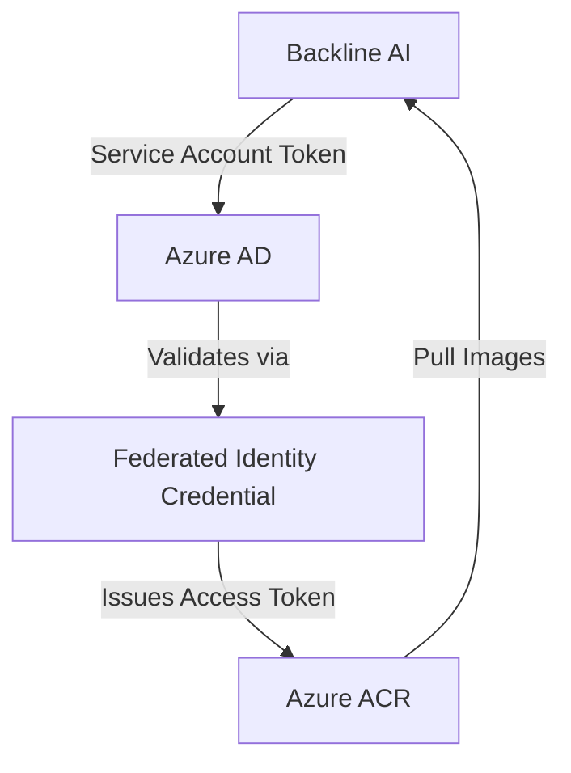

# Scripts Documentation

This directory contains scripts for managing Azure integrations with Backline AI.

## Table of Contents

- [Scripts Documentation](#scripts-documentation)
  - [Table of Contents](#table-of-contents)
  - [Overview](#overview)
  - [General Prerequisites](#general-prerequisites)
    - [Required Tools](#required-tools)
    - [General Requirements](#general-requirements)
  - [Common Scripts](#common-scripts)
    - [validate.sh](#validatesh)
  - [Azure Container Registry (ACR) Integration](#azure-container-registry-acr-integration)
    - [Overview](#overview-1)
    - [Architecture](#architecture)
    - [Required Azure Permissions](#required-azure-permissions)
    - [add\_backline\_acr\_fic.sh script](#add_backline_acr_ficsh-script)
    - [ACR Integration Workflow](#acr-integration-workflow)
      - [Initial Setup](#initial-setup)
      - [Re-running Installation](#re-running-installation)
    - [ACR Integration Troubleshooting](#acr-integration-troubleshooting)
      - [Azure CLI Authentication Issues](#azure-cli-authentication-issues)
      - [Permission Errors](#permission-errors)
      - [Configuration Issues](#configuration-issues)
      - [Resource Already Exists](#resource-already-exists)
      - [ACR Not Found](#acr-not-found)
      - [Federated Credential Creation Failed](#federated-credential-creation-failed)
    - [Verifying ACR Setup](#verifying-acr-setup)
    - [Listing Configured ACRs](#listing-configured-acrs)
    - [ACR Integration Security](#acr-integration-security)
  - [Support](#support)

## Overview

These scripts automate the setup and management of secure integrations between Backline AI and customer Azure resources. Each integration uses appropriate authentication mechanisms to enable passwordless, secure access.

## General Prerequisites

### Required Tools
- **Azure CLI** (`az`) version 2.30.0 or higher
  - Install: https://docs.microsoft.com/en-us/cli/azure/install-azure-cli
  - Verify: `az --version`
- **Bash shell** (Linux, macOS, or WSL on Windows)

### General Requirements
- Azure CLI authenticated: `az login`
- Correct subscription selected: `az account show`
- Appropriate Azure permissions (varies by integration)
- Configuration file filled in: [../config/params.sh](../config/params.sh)

## Common Scripts

### validate.sh

**Purpose**: Library of validation functions used by integration scripts

**Functions**:
- `validate_az_login()` - Verifies Azure CLI authentication
- `validate_acr()` - Confirms ACR exists in specified resource group
- `validate_permissions()` - Checks role assignment permissions
- `validate_params()` - Validates all required parameters in params.sh

**Usage**: This script is sourced by other scripts and not run directly.

---

## Azure Container Registry (ACR) Integration

### Overview

Enables Backline AI to pull container images from customer Azure Container Registries using OIDC-based workload identity federation. This eliminates the need for managing passwords or access keys.

### Architecture



### Required Azure Permissions

1. **Azure AD Permissions**:
   - `Application Administrator` OR `Global Administrator` role
   - Required for: Creating app registrations and service principals

2. **Azure RBAC Permissions**:
   - `Owner` OR `User Access Administrator` role on the ACR resource group
   - Required for: Assigning roles to service principals

### add_backline_acr_fic.sh script

**Purpose**: Creates Azure AD application, service principal, and federated identity credential for ACR access

**What it does**:
1. Validates Azure login and configuration
2. Creates or reuses Azure AD Application
3. Creates or reuses Service Principal
4. Creates Federated Identity Credential linking Backline AI OIDC to Azure AD
5. Assigns AcrPull and Reader roles to the service principal

**Features**:
- **Idempotent**: Safe to run multiple times
- **Error handling**: Validates each step and provides clear error messages
- **Reuses existing resources**: Won't fail if resources already exist

**Usage**:
```bash
# From repository root
./scripts/add_backline_acr_fic.sh
```

**Interactive Prompts**:
- `Enter ACR name:` - Name of the Azure Container Registry
- `Enter Resource Group name:` - Resource group containing the ACR

**Example Output**:
```bash
$ ./scripts/add_backline_acr_fic.sh

=== Azure ACR Federated Identity Setup for Backline AI ===

Enter ACR name: mycompanyacr
Enter Resource Group name: acr-resources

Validating environment...
Creating Azure AD Application...
Application created: 12345678-1234-1234-1234-123456789012
Creating Service Principal...
Service Principal created: 87654321-4321-4321-4321-210987654321
Creating Federated Identity Credential...
Federated Identity Credential 'eks-fic' created successfully
Assigning ACR Roles...
AcrPull role assigned successfully
Reader role assigned successfully

=== DONE ===

Tenant ID: aaaaaaaa-bbbb-cccc-dddd-eeeeeeeeeeee
Application (Client) ID: 12345678-1234-1234-1234-123456789012
Service Principal Object ID: 87654321-4321-4321-4321-210987654321
Federated Identity Credential: eks-fic
ACR Resource ID: /subscriptions/.../resourceGroups/acr-resources/providers/Microsoft.ContainerRegistry/registries/mycompanyacr

Your Azure AD app is ready for OIDC authentication from EKS.
```

**Output Information**:
Save these values from the output:
- **Tenant ID**: Customer's Azure AD tenant identifier
- **Application (Client) ID**: Used by Backline AI to authenticate

### ACR Integration Workflow

#### Initial Setup

1. Run `./scripts/add_backline_acr_fic.sh` from repository root
2. Save the output (Tenant ID and Application Client ID)
3. Provide the saved values to Backline AI

#### Re-running Installation
The install script is idempotent - it will:
- Detect existing resources and reuse them
- Only create missing components
- Update federated credentials if needed

### ACR Integration Troubleshooting

#### Azure CLI Authentication Issues

**Error**: `You must be logged into Azure CLI`

**Solution**:
```bash
az login
az account set --subscription <subscription-id>
az account show  # Verify
```

#### Permission Errors

**Error**: `You do not have permission to assign roles`

**Solution**:
- Verify you have Owner or User Access Administrator role on the resource group
- Check with: `az role assignment list --resource-group <rg-name> --include-inherited`
- Contact your Azure administrator to grant appropriate permissions

**Error**: `Failed to create Azure AD Application`

**Solution**:
- Verify you have Application Administrator role in Azure AD
- Check with: `az ad signed-in-user show --query "userPrincipalName"`
- Contact your Azure AD administrator

#### Configuration Issues

#### Resource Already Exists

**Scenario**: Application or service principal already exists

**Behavior**: The install script will:
- Detect existing resources
- Reuse them instead of creating new ones
- Display messages like "Application already exists with ID: ..."

**Note**: The script is designed to be safely re-run. It will not create duplicate resources.

#### ACR Not Found

**Error**: `ACR 'name' not found in resource group 'rg'`

**Solution**:
- Verify ACR name is correct (case-sensitive)
- Verify resource group name is correct
- Check ACR exists: `az acr show -n <acr-name> -g <rg-name>`
- Verify you're in the correct subscription: `az account show`

#### Federated Credential Creation Failed

**Error**: `Failed to create Federated Identity Credential`

**Common causes**:
1. **Conflicting credential**: A federated credential with the same subject may already exist
3. **Permissions**: Ensure you have Application Administrator role

**Solution**:
- Check existing credentials: `az ad app federated-credential list --id <app-id>`
- Delete conflicting credential if needed: `az ad app federated-credential delete --id <app-id> --federated-credential-id <cred-id>`
- Verify params.sh configuration

### Verifying ACR Setup

After installation, verify the configuration:

```bash
# Check application
az ad app show --id <app-id>

# Check service principal
az ad sp show --id <app-id>

# Check federated credential
az ad app federated-credential list --id <app-id>

# Check role assignments
az role assignment list --assignee <sp-object-id> --scope <acr-resource-id>

# Check ACR access (optional - requires ACR login)
az acr repository list --name <acr-name>
```

### Listing Configured ACRs

To find which ACRs have Backline AI access:

```bash
# Find all role assignments for the service principal
az role assignment list --assignee <sp-object-id> --query "[?roleDefinitionName=='AcrPull'].scope" -o table
```

### ACR Integration Security

- **Least Privilege**: Only AcrPull and Reader roles are assigned
- **Scoped Access**: Permissions are scoped to specific ACR resources
- **No Long-lived Secrets**: Uses OIDC federation instead of passwords
- **Audit Trail**: All operations are logged in Azure Activity Log
- **Verification**: Always verify the Application ID matches what Backline AI expects

---

## Support

For issues not covered in this documentation:
1. Review error messages carefully
2. Check Azure Activity Log for detailed error information
3. Verify all prerequisites are met
4. Contact [Backline support](mailto:support@backline.ai) for assistance
